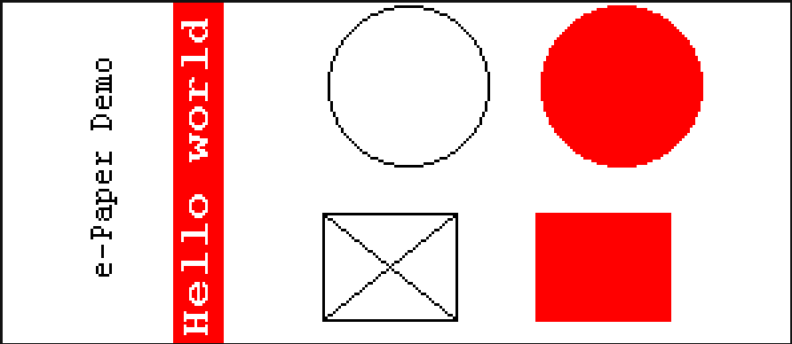

# pyFirmata ePaper display library

A library to create and send image data to an ePaper display connected to a firmata powered microcontroller.

Supports both pyFirmata and pyFirmata2 libraries!


## Info

Code has been tested with the Waveshare 2.9 inch black-white and red-white display.

The code should support other displays as well,
because [Waveshare provides .cpp and .h files](https://github.com/waveshareteam/e-Paper/tree/master/Arduino) for each of their displays.

Guide below should help you. If you were to run into issues after you done all the steps according to your display,
then you could make an issue if there isn't one for your display yet.


## Setting up

You cannot just use the default StandardFirmata.ino file without making changes to it for this code to work.

See [code_pieces_for_ino.md](code_pieces_for_ino.md) for the changes you need to make.


After that install either `pyFirmata2` OR `pyFirmata` library using pip.
And then install this library as well.


## API/Example

Here is an example code with comments to explain the API functions:

```py
# Import pyfirmata2
from pyfirmata2 import Arduino
# or import pyfirmata
# from pyfirmata import Arduino

# Imports
from pyfirmata_epd.epd import Epd
from pyfirmata_epd.paint import Paint, COLORED, UNCOLORED
from pyfirmata_epd.fonts import Font12, Font16

# Open connection to board:
board = Arduino(Arduino.AUTODETECT)
print('Started up')
# Always enable sampling!
board.samplingOn()

# Init epaper display:
epd = Epd(board)
# Wake the display up (since it will always go in sleep mode)
epd.Reset()

# To clear the display:
epd.Clear()

# To display pixels:
epd.DisplayFrame([0xFF, ..., 0xFF], [0xFF, ..., 0xFF]) # black-white data, red-white data


# To easily draw shapes and stuff:
paint = Paint([], 128, 296) # Init empty buffer with width of 128 (must be multiple of 8, since 8 pixels are in 1 byte) and height of 296
# Init another paint for red pixels
paintRed = Paint([], 128, 296)

# Clear paint
paint.Clear(UNCOLORED)
paintRed.Clear(UNCOLORED)

# Draw string
paint.DrawStringAt(24, 32, "e-Paper Demo", Font12, COLORED)

# Draw string with 'inversed background'
paintRed.DrawFilledRectangle(0, 64, 128, 82, COLORED)
paintRed.DrawStringAt(2, 66, "Hello world", Font16, UNCOLORED)

# Draw rectangle with cross
paint.DrawRectangle(8, 120, 48, 170, COLORED)
paint.DrawLine(8, 120, 48, 170, COLORED)
paint.DrawLine(48, 120, 8, 170, COLORED)

# Draw circle
paint.DrawCircle(96, 152, 30, COLORED)

# Draw filled rectangle
paintRed.DrawFilledRectangle(8, 200, 48, 250, COLORED)

# Draw filled circle
paintRed.DrawFilledCircle(96, 232, 30, COLORED)

# Display on epaper display
epd.DisplayFrame(paint.GetImage(), paintRed.GetImage())
```

The paint should look like:



Extra API documentation can be found on the [ReadTheDocs](https://pyfirmata_epd.readthedocs.io/en/latest/) documentation.
